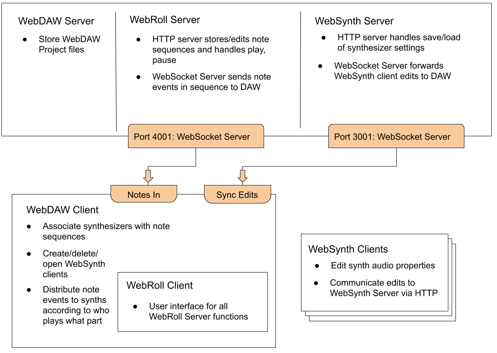

# WebDAW

## Overview
A cloud-native digital audio workstation. Create and access multiple synthesizers from one location. This was developed to solve the problem of connecting multiple synthesizers to a single note sequencer. Implementing full functionality is still in progress--see work in feature branches on [WebRoll](https://github.com/slhodak/WebRoll).  

## Installation
First ensure that an instance of the [WebSynth](https://github.com/slhodak/WebSynth) server is running locally. Then,   
1) Clone this repo
2) `npm install`
3) `npm start`
4) Navigate to `localhost:9000`

## Architecture

## Usage
This DAW must be used in conjunction with (at least) [WebSynth](https://github.com/slhodak/WebSynth).   

Create new synthesizers using the 'New' button.  
Clicking 'Open' on a synthesizer will open a new window where that synth's properties can be edited and saved. The synthesizer can be played when either window is open. Synth edits made in any synthesizer opened from the DAW, including name changes, are synced to the DAW and will be audible (or visible) upon returning to the DAW window. 

Load saved synthesizers with the 'Load' button.  